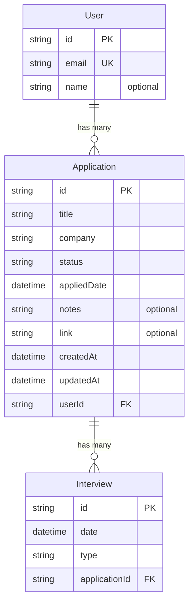

# JobTrack

JobTrack is a job application tracker. It's a place to keep track of the jobs I've applied to, what stage each one is at (Applied, Interview, Offer, Rejected), and notes for each one.

This is my field training project at FiberTech Jo, built with Next.js over 6 weeks.

## Stack

- Next.js 16 (App Router)
- React 19
- JavaScript, no TypeScript
- Tailwind CSS 4
- Prisma ORM with SQLite

## Running it

```bash
npm install
npx prisma migrate dev
npx prisma db seed
npm run dev
```

Then open [http://localhost:3000](http://localhost:3000).

The database is a single SQLite file at `prisma/dev.db`. It isn't committed to the repo, since the migration files in `prisma/migrations/` recreate it from scratch and the seed script fills it with sample data.

To browse the data in a GUI:

```bash
npx prisma studio
```

## Progress

### Week 1: foundations and project setup

The goal for week 1 was getting the app structure working: a navbar, a sidebar, and a few pages I can click between. No database or real data yet, everything is static or placeholder.

I also added a landing page at `/` on top of the plan, just to make the project feel a bit more finished. It links into the dashboard.

What I built:

- Set up the Next.js project (App Router) with Tailwind CSS
- A landing page at `/` with a hero section and a single call to action
- The navbar and sidebar only show up on the dashboard pages, not on the landing page
- Sidebar highlights whichever page you're currently on
- Sidebar collapses into a hamburger menu on mobile
- A purple color theme across the app

Pages so far:

| Route               | What's there                          |
| ------------------- | ------------------------------------- |
| `/`                 | landing page, links to `/dashboard`   |
| `/dashboard`        | placeholder stats, nothing real yet   |
| `/applications`     | empty list + "Add Application" button |
| `/applications/new` | form UI only, doesn't save anything   |

"Get Started" links straight to `/dashboard` for now since there's no auth yet.

Tagged as `v1-week1`.

### Week 2: database and data modeling

Week 2 was about designing the schema and getting a real database connected. The pages aren't wired up to it yet, that comes in week 3, so everything this week was done through scripts.

What I built:

- Set up Prisma with SQLite as the local database
- Designed the schema: User, Application and Interview
- Ran the first migration, which created `prisma/dev.db` and the three tables
- Wrote a seed script with 7 sample applications and 7 interviews across all four statuses
- Wrote a scratch script with a few queries to confirm reads and writes actually work

One thing I ran into: I pinned Prisma to version 6 on purpose. Version 7's client generator only outputs TypeScript files and I'm not very familiar with its syntax. `prisma init` also downloads its template at runtime, so even with version 6 installed it scaffolded a version 7 style config. I fixed the generator provider and deleted the config file it created.

Tagged as `v1-week2`.

### Week 3: CRUD operations

Week 3 connected the pages to the database. By the end of it every application can be created, read, edited and deleted from the app itself, with nothing done through scripts.

What I built:

- `/applications` reads the list from the database instead of showing placeholder cards
- A detail page at `/applications/[id]` showing everything about one application, including its interviews
- The "Add Application" form now saves, using a server action
- An edit page at `/applications/[id]/edit` that reuses the same form, pre-filled with the current values
- Delete, from both the list cards and the detail page
- Queries moved into `lib/applications.js` so the pages don't hold Prisma calls directly
- The three server actions live together in `app/(app)/applications/actions.js`

The create and edit pages share one `ApplicationForm` component. It takes the action to run and, optionally, an existing application to fill the fields from. Nothing in it uses `useState`, since a plain form with `name` attributes on the inputs gives the server action everything it needs, so it stays a server component like the rest of the app.

One thing I ran into: after saving a new application and redirecting to the list, the new row didn't show up. It was in the database the whole time, Next.js was just serving a cached render of the page. The fix is `revalidatePath("/applications")` inside the action, and it has to come before `redirect(...)`, because `redirect` works by throwing so nothing after it runs.

Deleting an application also deletes its interviews, and I didn't write any code for that. It comes from `onDelete: Cascade` in the schema from week 2, so the database handles it.

Applications are still assigned to the seeded user, since there's no login yet. The create action looks that user up with `prisma.user.findFirst()`. That line goes away in week 4 when auth arrives and there's a real session to read from.

Tagged as `v1-week3`.

## Data model

JobTrack stores job applications for a user, and each application can have interviews attached to it.



There are two one to many relationships here. One user has many applications, and one application has many interviews. In both cases the relationship is stored as a foreign key on the child table, so `Application.userId` points back to a user and `Interview.applicationId` points back to an application. Both use `onDelete: Cascade`, which means deleting an application also deletes the interviews that belong to it.

A few decisions worth writing down:

- IDs are cuid strings rather than auto incrementing numbers, so they don't leak how many records exist and don't need converting from the URL
- `appliedDate` is the date I actually applied, which is different from `createdAt`, the date the row was saved
- `status` is a plain string instead of an enum because SQLite doesn't support enums. The values used in the app are Applied, Interview, Offer and Rejected
- There are indexes on both foreign keys, since looking up children by their parent is the query that runs most often

## Folder structure

```
app/
  layout.js                          root layout, fonts + metadata
  page.js                            landing page
  globals.css                        brand colors as Tailwind tokens
  icon.svg                           favicon
  (app)/
    layout.js                        navbar + sidebar shell for the dashboard pages
    dashboard/page.jsx
    applications/page.jsx            the list
    applications/new/page.jsx        create form
    applications/actions.js          create, update and delete server actions
    applications/[id]/page.jsx       detail page
    applications/[id]/edit/page.jsx  edit form
components/
  LayoutShell.jsx                    navbar + sidebar + page content
  Navbar.jsx
  Sidebar.jsx
  SidebarNav.jsx                     handles the active link highlighting
  StatCard.jsx
  StatusBadge.jsx                    the status pill, and the colour for each status
  ApplicationForm.jsx                shared by the create and edit pages
  DeleteApplicationButton.jsx        a form with a hidden id, not a link
lib/
  prisma.js                          single Prisma client instance, reused across hot reloads
  applications.js                    the queries the pages read from
prisma/
  schema.prisma                      the data model
  seed.js                            sample data
  test-queries.js                    scratch script to check the queries work
  migrations/                        generated SQL, committed so the database can be rebuilt
```
