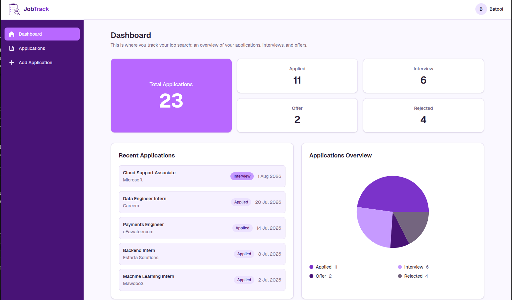
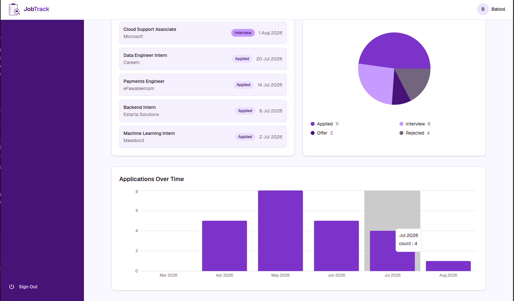
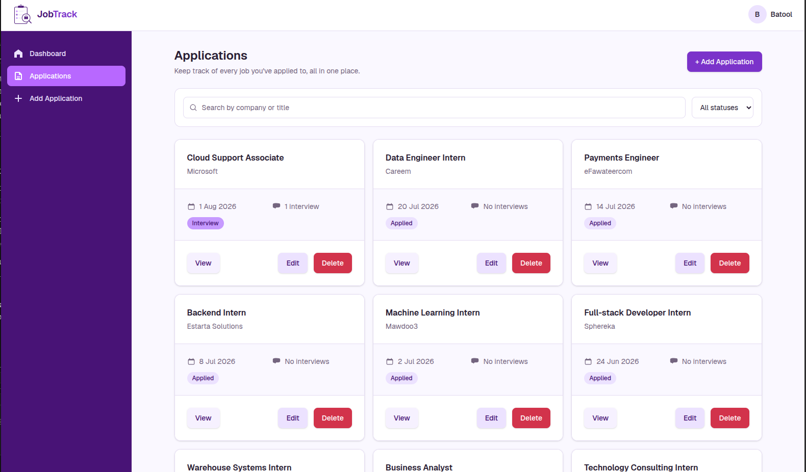
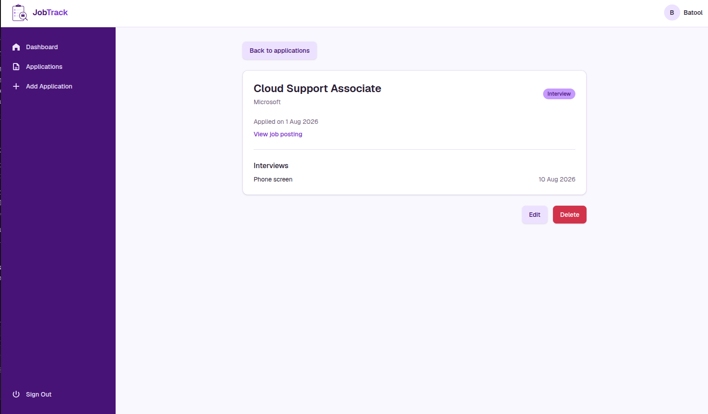
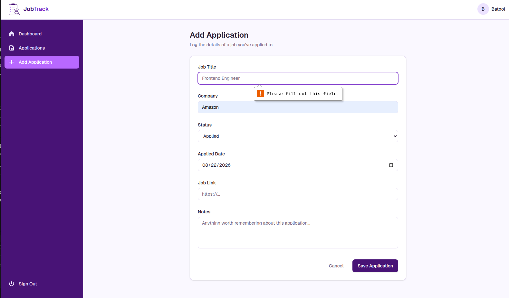
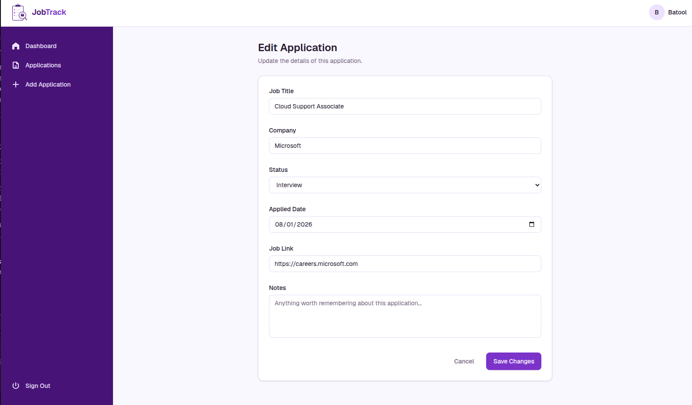
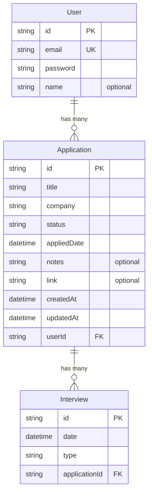

# JobTrack

JobTrack is a job application tracker. It's a place to keep track of the jobs I've applied to, what stage each one is at (Applied, Interview, Offer, Rejected), and notes for each one.

This is my field training project at FiberTech Jo, built with Next.js over 6 weeks.

**Live at [jobtrack-swart.vercel.app](https://jobtrack-swart.vercel.app/)**

You can sign up for your own account, or log in with `batool@example.com` / `password123` to see the sample data.

## Features

- Sign up and log in. Each account only ever sees its own applications
- Add, view, edit and delete applications
- Search by company or job title, and filter by status
- Pagination once the list gets long
- A dashboard with totals per status, a status breakdown chart, and applications per month
- Interviews are linked to applications and show on the detail page. They come from the seed data; there's no form for adding one yet

## Screenshots

### Dashboard



### Applications over time



### Applications list



### Application detail



### Add and edit




## Tech Stack

| Part       | What it uses                                |
| ---------- | ------------------------------------------- |
| Framework  | Next.js 16, App Router                      |
| UI         | React 19, Tailwind CSS 4                    |
| Language   | JavaScript, no TypeScript                   |
| Database   | Turso, hosted SQLite                        |
| ORM        | Prisma 6, through the libSQL driver adapter |
| Auth       | Auth.js (NextAuth v5), credentials provider |
| Validation | Zod                                         |
| Passwords  | bcrypt                                      |
| Charts     | Recharts                                    |
| Tests      | Vitest and React Testing Library            |
| Hosting    | Vercel                                      |

## Project Structure

```
app/           routes, layouts and server actions
components/    shared UI
lib/           database queries, validation schemas and helpers
prisma/        schema, migrations and the seed script
__tests__/     tests
docs/          screenshots used in this file
```

## Prerequisites

Before running the project, make sure you have these:

- Git
- Node.js 20 or newer, and npm
- A Turso account. The free tier is enough
- The Turso CLI, installed with `curl -sSfL https://get.tur.so/install.sh | bash`
  The app talks to Turso over HTTPS rather than reading a local database file, so you need a database of your own before it will start. Turso's [docs](https://docs.turso.tech/) cover creating one.

## Quick Start

### 1. Clone the Project

```bash
git clone https://github.com/BatoolHani1/jobtrack.git
cd jobtrack
npm install
```

### 2. Create a Turso Database

```bash
turso auth signup
turso db create jobtrack
turso db show jobtrack --url
turso db tokens create jobtrack
```

Keep the URL and the token. You need both in the next step.

### 3. Set the Environment Variables

```bash
cp .env.example .env
```

Then fill in all four values:

| Variable             | Value                                       |
| -------------------- | ------------------------------------------- |
| `TURSO_DATABASE_URL` | the `libsql://` URL from `turso db show`    |
| `TURSO_AUTH_TOKEN`   | the token from `turso db tokens create`     |
| `AUTH_SECRET`        | generate one with `openssl rand -base64 32` |
| `DATABASE_URL`       | leave it as `file:./dev.db`                 |

Important notes:

- `DATABASE_URL` is not the database the app uses. Nothing connects to it. It is there so the Prisma CLI can parse the schema, which still declares `url = env("DATABASE_URL")`
- The app reads `TURSO_DATABASE_URL` and `TURSO_AUTH_TOKEN` instead, because the connection string is passed to the driver adapter in `lib/prisma.js` rather than coming from the schema
- The token is a live credential for the database. Do not commit it

### 4. Create the Tables

A new Turso database is empty. Generate the schema and apply it:

```bash
npx prisma migrate diff --from-empty --to-schema-datamodel prisma/schema.prisma --script > baseline.sql
turso db shell jobtrack < baseline.sql
```

Check it worked:

```bash
turso db shell jobtrack ".tables"
```

You should see `Application`, `Interview` and `User`.

Important notes:

- The files in `prisma/migrations/` are not used here. They are SQLite DDL written for a local file, and the one that adds the password column uses `PRAGMA` statements that do not behave the same over HTTP. The baseline above produces the same schema without them
- `prisma migrate deploy` also writes a `_prisma_migrations` table to track what it applied. Running the SQL through the Turso CLI does not, so Turso has the schema but no migration history. That is fine here, because Prisma Migrate never talks to Turso. Schema changes are written locally and the result is applied to Turso by hand

### 5. Seed and Run

```bash
npx prisma db seed
npm run dev
```

Then open [http://localhost:3000](http://localhost:3000).

**`npx prisma db seed` deletes everything before it inserts.** It runs against whatever `TURSO_DATABASE_URL` points at, so do not run it against a database you care about.

## Useful Commands

| Command                                       | What it does                                                 |
| --------------------------------------------- | ------------------------------------------------------------ |
| `npm run dev`                                 | starts the dev server                                        |
| `npm run build`                               | production build                                             |
| `npm test`                                    | runs the tests in watch mode                                 |
| `npm run test:run`                            | runs the tests once and exits                                |
| `npx prisma db seed`                          | wipes and reseeds the database                               |
| `npx prisma studio`                           | opens a GUI at localhost:5555                                |
| `node --env-file=.env prisma/test-queries.js` | runs five queries against the database as a connection check |

Note that `npx prisma studio` reads `DATABASE_URL`, so it opens the local `prisma/dev.db` file, not Turso. Use `turso db shell jobtrack` to look at the live data.

## Testing

```bash
npm run test:run
```

12 tests across four files:

| File                                         | What it covers                                                          |
| -------------------------------------------- | ----------------------------------------------------------------------- |
| `__tests__/validation.test.js`               | the Zod schemas for applications and signup                             |
| `__tests__/format.test.js`                   | the date formatter                                                      |
| `__tests__/StatusBadge.test.jsx`             | the status pill, including the fallback for an unknown status           |
| `__tests__/ApplicationStatusFilter.test.jsx` | the status dropdown, with a mocked router and a real select interaction |

The pages are not covered. They are async Server Components, which Vitest cannot render, so they are checked by hand. End to end tests would be the way to cover them properly.

## Data Model

JobTrack stores job applications for a user, and each application can have interviews attached to it.



There are two one to many relationships. One user has many applications, and one application has many interviews. In both cases the relationship is stored as a foreign key on the child table, so `Application.userId` points back to a user and `Interview.applicationId` points back to an application. Both use `onDelete: Cascade`, so deleting an application also deletes the interviews that belong to it.

- IDs are cuid strings rather than auto incrementing numbers, so they do not leak how many records exist and do not need converting from the URL
- `appliedDate` is the date I actually applied. `createdAt` is the date the row was saved.
- `status` is a plain string instead of an enum because SQLite has no enums. The four values live in `lib/statuses.js`
- There are indexes on both foreign keys, since looking up children by their parent is the query that runs most often
- `password` stores a bcrypt hash, never the password itself.

Sessions are stored in a signed cookie rather than the database, so there is nothing to keep track of on our side.

## Progress

The project was built to a 6 week plan. A short note for each week's progress:

### Week 1: Foundations and Project Setup

App shell only. Next.js with the App Router, Tailwind, a landing page and three placeholder routes. The navbar and sidebar show on the dashboard pages but not on the landing page. No database yet.

Tagged as `v1-week1`.

### Week 2: Database and Data Modeling

Prisma with SQLite, the User, Application and Interview schema, the first migration, a seed script and a scratch script to confirm reads and writes work. The pages were not wired up yet.

Prisma is pinned to version 6 on purpose. Version 7's client generator only outputs TypeScript.

Tagged as `v1-week2`.

### Week 3: CRUD Operations

Create, read, edit and delete, all from the app. Queries moved into `lib/applications.js`. The create and edit pages share one form component, with no `useState` in it, since a plain form with `name` attributes gives a server action everything it needs.

Deleting an application also deletes its interviews, and I wrote no code for it. That comes from `onDelete: Cascade` in the schema.

New rows did not appear after redirecting, because Next.js was serving a cached render. `revalidatePath` fixes it, and has to run before `redirect`.

Tagged as `v1-week3`.

### Week 4: Authentication and Validation

Signup, login, route protection, and Zod validation. Every query scoped to the logged in user.

The two auth files are deliberate. Route protection runs on the Edge runtime, where bcrypt and Prisma do not work, so the config is split from the credentials provider.

Applications are scoped in two places. The pages pass the user id into the queries, and the edit and delete actions check both id and user id. The second check is the real boundary, because a server action is just a POST.

Next.js 16 renamed `middleware.js` to `proxy.js`. A leftover `middleware.js` is ignored silently, so route protection would have done nothing and every page would have stayed public.

Tagged as `v1-week4`.

### Week 5: Search, Filtering and the Dashboard

Search, status filter, pagination, dashboard stats, two charts, empty states and skeletons. The seed grew to 25 applications so there was enough data to test against.

Search, status and page all live in the URL rather than React state, which is why the applications page can still be a server component querying Prisma directly.

`mode: "insensitive"` does not exist on SQLite and throws at query time. It is also unnecessary, since SQLite's `LIKE` already ignores case for English text.

SQLite cannot group dates by month through Prisma, so the bar chart groups in JavaScript, creating the months first so an empty one still shows.

Tagged as `v1-week5`.

### Week 6: Testing, Deployment and Shipping

Moved to Turso, deployed to Vercel, added Vitest and React Testing Library with 12 tests, and rewrote this README.

Turso is SQLite over HTTPS, which Prisma's query engine cannot speak, so queries go through the libSQL driver adapter. Prisma still compiles the SQL. Not one query changed.

The adapter defaults to ISO date strings while Prisma's SQLite driver stores epoch milliseconds, so `timestampFormat: "unixepoch-ms"` is required or every date reads back wrong.

Vercel caches dependencies, so Prisma's postinstall hook stops firing after the first build. `"postinstall": "npx prisma generate"` fixes it.

Writing the validation tests meant moving the Zod schemas into `lib/validation.js`, since importing a `"use server"` file pulled in Prisma, auth and bcrypt.

Tagged as `v1-week6`.
