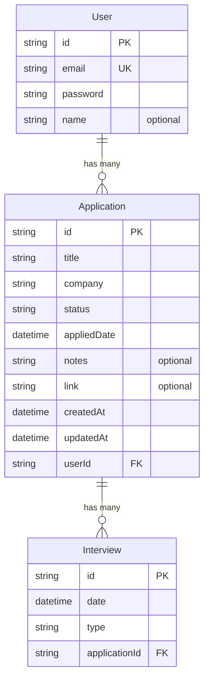

# JobTrack

JobTrack is a job application tracker. It's a place to keep track of the jobs I've applied to, what stage each one is at (Applied, Interview, Offer, Rejected), and notes for each one.

This is my field training project at FiberTech Jo, built with Next.js over 6 weeks.

## Stack

- Next.js 16 (App Router)
- React 19
- JavaScript, no TypeScript
- Tailwind CSS 4
- Prisma ORM with SQLite
- Auth.js (NextAuth v5) for login and signup
- Zod for form validation
- bcrypt for password hashing
- Recharts for the dashboard charts
- use-debounce for the search input

## Running it

You need a `.env` file before the database commands will work. Copy the example and fill it in:

```bash
cp .env.example .env
```

It needs two things. `DATABASE_URL` points at the SQLite file, and `AUTH_SECRET` is the key used to sign the session cookie. You can generate a secret with:

```bash
openssl rand -base64 32
```

Then:

```bash
npm install
npx prisma migrate dev
npx prisma db seed
npm run dev
```

Then open [http://localhost:3000](http://localhost:3000).

The seed script creates one user you can log in as:

- Email: `batool@example.com`
- Password: `password123`

Or sign up for a new account at `/signup`, which starts you off with an empty list.

The database is a single SQLite file at `prisma/dev.db`. It isn't committed to the repo, since the migration files in `prisma/migrations/` recreate it from scratch and the seed script fills it with sample data.

To browse the data in a GUI:

```bash
npx prisma studio
```

## Progress

### Week 1: foundations and project setup

The goal for week 1 was getting the app structure working: a navbar, a sidebar, and a few pages I can click between. No database or real data yet, everything is static or placeholder.

I also added a landing page at `/` on top of the plan, just to make the project feel a bit more finished. It links into the dashboard.

What I built:

- Set up the Next.js project (App Router) with Tailwind CSS
- A landing page at `/` with a hero section and a single call to action
- The navbar and sidebar only show up on the dashboard pages, not on the landing page
- Sidebar highlights whichever page you're currently on
- Sidebar collapses into a hamburger menu on mobile
- A purple color theme across the app

Pages so far:

| Route               | What's there                          |
| ------------------- | ------------------------------------- |
| `/`                 | landing page, links to `/dashboard`   |
| `/dashboard`        | placeholder stats, nothing real yet   |
| `/applications`     | empty list + "Add Application" button |
| `/applications/new` | form UI only, doesn't save anything   |

At this point "Get Started" linked straight to `/dashboard`, since there was no auth yet.

Tagged as `v1-week1`.

### Week 2: database and data modeling

Week 2 was about designing the schema and getting a real database connected. The pages aren't wired up to it yet, that comes in week 3, so everything this week was done through scripts.

What I built:

- Set up Prisma with SQLite as the local database
- Designed the schema: User, Application and Interview
- Ran the first migration, which created `prisma/dev.db` and the three tables
- Wrote a seed script with 7 sample applications and 7 interviews across all four statuses
- Wrote a scratch script with a few queries to confirm reads and writes actually work

One thing I ran into: I pinned Prisma to version 6 on purpose. Version 7's client generator only outputs TypeScript files and I'm not very familiar with its syntax. `prisma init` also downloads its template at runtime, so even with version 6 installed it scaffolded a version 7 style config. I fixed the generator provider and deleted the config file it created.

Tagged as `v1-week2`.

### Week 3: CRUD operations

Week 3 connected the pages to the database. By the end of it every application can be created, read, edited and deleted from the app itself, with nothing done through scripts.

What I built:

- `/applications` reads the list from the database instead of showing placeholder cards
- A detail page at `/applications/[id]` showing everything about one application, including its interviews
- The "Add Application" form now saves, using a server action
- An edit page at `/applications/[id]/edit` that reuses the same form, pre-filled with the current values
- Delete, from both the list cards and the detail page
- Queries moved into `lib/applications.js` so the pages don't hold Prisma calls directly
- The three server actions live together in `app/(app)/applications/actions.js`

The create and edit pages share one `ApplicationForm` component. It takes the action to run and, optionally, an existing application to fill the fields from. Nothing in it uses `useState`, since a plain form with `name` attributes on the inputs gives the server action everything it needs, so at this point it was still a server component like the rest of the app. That changed in week 4.

One thing I ran into: after saving a new application and redirecting to the list, the new row didn't show up. It was in the database the whole time, Next.js was just serving a cached render of the page. The fix is `revalidatePath("/applications")` inside the action, and it has to come before `redirect(...)`, because `redirect` works by throwing so nothing after it runs.

Deleting an application also deletes its interviews, and I didn't write any code for that. It comes from `onDelete: Cascade` in the schema from week 2, so the database handles it.

Applications were still assigned to the seeded user at this point, since there was no login yet. The create action looked that user up with `prisma.user.findFirst()`. That line went away in week 4, once there was a real session to read from.

Tagged as `v1-week3`.

### Week 4: authentication and validation

Week 4 turned JobTrack from something one person uses into something several people can. Before this week every application belonged to the single user the seed script created. Now you sign up, log in, and only ever see your own.

What I built:

- A signup page at `/signup` that creates a user with a bcrypt hashed password
- A login page at `/login` using Auth.js with a credentials provider
- Every query scoped to the logged in user, so two accounts never see each other's applications
- Route protection, so visiting `/dashboard` or `/applications` while logged out sends you to the login page
- A sign out button at the bottom of the sidebar
- The logged in user's name in the navbar, falling back to their email if they haven't set one
- Zod validation on the application form, with error messages under each field

There are two auth files and that's on purpose. `auth.config.js` holds the configuration and nothing else. `auth.js` holds the credentials provider, which imports bcrypt and Prisma. They're split because route protection runs on the Edge runtime, where neither bcrypt nor Prisma works, so the proxy file can only import the config half.

Signing up logs you straight in rather than sending you to the login page afterwards. The `signIn` call has to sit outside the `try/catch` around creating the user, for the same reason `redirect` did in week 3: it works by throwing, and the catch block would swallow it.

Applications are scoped in two places. The pages read the session and pass the user id into the queries in `lib/applications.js`, so the list and detail pages only ever return your own rows. The edit and delete actions look the application up by both id and user id before touching it, and return a 404 if nothing comes back. That second check is the one that actually matters, because a server action is just a POST and someone could send one carrying another user's application id.

Route protection sits on top of that as a separate layer. It stops the request before the page renders, which is faster and means a logged out visitor never sees a broken page. But it's a convenience, not the security boundary. The checks inside the actions are what protect the data.

The form has two layers of validation for the same reason. `required` and `type="url"` are the browser's checks, and they're instant and free. Zod runs on the server after submit and is the one that can't be switched off in dev tools. Both are worth having: the browser catches honest mistakes without a round trip, and Zod is what stops bad data reaching the database.

One thing I ran into: Next.js 16 renamed the `middleware.js` file convention to `proxy.js`. A leftover `middleware.js` is ignored with no build error and no warning at all, so the route protection would have quietly done nothing and every page would have stayed public. Nothing tells you it isn't running. The way I confirmed it was working was seeing `Proxy` listed in the `next build` output.

Another one: after a failed submit, React 19 resets a form that uses the `action` prop. That wiped every field, so fixing one wrong value meant retyping the whole form. The fix was to return the submitted values from the action alongside the errors, and use those as the `defaultValue` for each input. The inputs stay uncontrolled, so there's still no `useState` or `onChange` anywhere in the form.

`ApplicationForm` did become a client component this week. Showing errors that come back from the server needs `useActionState`, and that's a React hook. It and `SidebarNav` are the only two client components in the app.

Tagged as `v1-week4`.

### Week 5: search, filtering and the dashboard

Week 5 was about making JobTrack feel like a product instead of a list of rows. The applications page got search, a status filter and pagination, and the dashboard finally shows real numbers instead of the placeholder zeros it had been showing since week 1.

The seed script grew to 25 applications spread over several months, because search, pagination and a chart of applications over time are all impossible to test properly with seven rows.

What I built:

- Search by company or job title on `/applications`
- Filter by status, which combines with the search
- Pagination, 9 applications per page
- Dashboard stats: total applications and a count for each status
- A pie chart of the status breakdown and a bar chart of applications per month
- A recent applications list on the dashboard
- Empty states that say what actually happened, and loading skeletons

The search term, the status and the page number all live in the URL instead of in React state. That's the whole reason the applications page can still be a server component that queries Prisma directly. If the search term lived in `useState` the page would need `"use client"`, and then it couldn't touch Prisma at all, so I'd have had to build an API route and fetch from it. Keeping it in the URL also means a filtered list is a link you can share, and the back button works without any code.

The list query and the count query behind pagination build their `where` clause from the same function. If they ever disagreed, the page controls would offer pages that come back empty, and each query would still look correct on its own.

The four statuses used to be written out in three separate files: the badge colors, the form's dropdown and the Zod schema. The filter would have made a fourth. They're all in `lib/statuses.js` now. The validator is the one that made it worth doing, because if the form ever offered a status the validator rejected, saving would fail with an error you can't fix from the page.

I built pagination even though the plan only lists it under "learn" and not under "build". The chapter I was following covers it right after search and I wanted the whole thing. The recent applications list isn't in the plan either, but that section had a "coming in a later week" badge sitting on it and finishing it seemed better than leaving it there. There are two charts rather than one because the plan asks for applications over time as a stat, and a pie chart can't show time.

One thing I ran into: `mode: "insensitive"`, which every Prisma search example uses, doesn't exist on SQLite. It throws when the query runs, not when the app builds, so everything looks fine until you actually type something. It also isn't needed, because `contains` becomes SQL `LIKE` and SQLite's `LIKE` already ignores case for ordinary English text. The examples are all written for Postgres, where it is needed.

Another one: SQLite has no way to group dates by month through Prisma, so the bar chart does its grouping in JavaScript. The six months have to be created first and then filled in. If you build them from the dates you have, a month with no applications disappears from the chart instead of showing as an empty bar.

And another: `loading.js` shows its skeleton when you navigate into a route, but not when you only change the search params on a route you're already on. So arriving at `/applications` shows the skeleton and typing in the search box doesn't. I left it that way, since a skeleton flashing every time you pause typing would be worse than the list quietly updating.

The dashboard streams instead of using `loading.js`. Its queries moved out of the page and down into the components that Suspense wraps, because Suspense suspends on whatever is doing the awaiting. With the `await` at the top of the page, the page itself is what suspends and a boundary inside it never gets reached.

The last one had been there since week 1. `globals.css` was setting the font to Arial, which overrode the Geist font `layout.js` loads. The whole site had been rendering in Arial the entire time and I only noticed this week.

I skipped the custom 404 page. It isn't in the plan and Next's default one works. The delete confirmation dialog still isn't built, it's been deferred since week 3.

Tagged as `v1-week5`.

## Data model

JobTrack stores job applications for a user, and each application can have interviews attached to it.



There are two one to many relationships here. One user has many applications, and one application has many interviews. In both cases the relationship is stored as a foreign key on the child table, so `Application.userId` points back to a user and `Interview.applicationId` points back to an application. Both use `onDelete: Cascade`, which means deleting an application also deletes the interviews that belong to it.

A few decisions worth writing down:

- IDs are cuid strings rather than auto incrementing numbers, so they don't leak how many records exist and don't need converting from the URL
- `appliedDate` is the date I actually applied, which is different from `createdAt`, the date the row was saved
- `status` is a plain string instead of an enum because SQLite doesn't support enums. The values used in the app are Applied, Interview, Offer and Rejected, and they live in `lib/statuses.js`
- There are indexes on both foreign keys, since looking up children by their parent is the query that runs most often
- `password` stores a bcrypt hash, never the password itself. It was added in week 4

There's no session table, which looks like something is missing until you know why. Sessions are stored in a signed cookie rather than the database, so there's nothing to keep track of on our side.

## Folder structure

```
auth.config.js                       auth settings and the route protection rule
auth.js                              the credentials provider, bcrypt and Prisma live here
proxy.js                             runs before every page and checks whether you're allowed in
app/
  layout.js                          root layout, fonts + metadata
  page.js                            landing page
  globals.css                        brand colors as Tailwind tokens
  icon.svg                           favicon
  login/
    page.jsx
    LoginForm.jsx                    reads callbackUrl so you land back where you were
    actions.js
  signup/
    page.jsx
    SignupForm.jsx
    actions.js                       validates, hashes the password, then logs you in
  (app)/
    layout.js                        navbar + sidebar shell for the dashboard pages
    dashboard/page.jsx               heading only, everything else streams in
    applications/page.jsx            the list, reads search, status and page from the URL
    applications/loading.js          skeleton shown while the list loads
    applications/new/page.jsx        create form
    applications/actions.js          create, update and delete server actions
    applications/[id]/page.jsx       detail page
    applications/[id]/edit/page.jsx  edit form
components/
  LayoutShell.jsx                    navbar + sidebar + page content
  Navbar.jsx                         shows who's logged in
  Sidebar.jsx                        holds the sign out button
  SidebarNav.jsx                     active link highlighting, closes the mobile sidebar
  ApplicationSearch.jsx              writes the search term into the URL, debounced
  ApplicationStatusFilter.jsx        writes the status into the URL
  ApplicationPagination.jsx          page links, built from the current search params
  ApplicationsEmptyState.jsx         a different message for each reason the list is empty
  StatCard.jsx
  TotalApplicationsCard.jsx
  StatusBadge.jsx                    the status pill, and the color for each status
  RecentApplications.jsx             the five most recent, on the dashboard
  ApplicationsPieChart.jsx           status breakdown, Recharts
  ApplicationsOverTimeChart.jsx      applications per month, Recharts
  DashboardOverview.jsx              fetches the stats and renders the top of the dashboard
  ApplicationsOverTimeSection.jsx    fetches the monthly counts for the bar chart
  DashboardOverviewSkeleton.jsx      Suspense fallbacks for the two above
  ApplicationsOverTimeSkeleton.jsx
  ApplicationForm.jsx                shared by the create and edit pages
  DeleteApplicationButton.jsx        a form with a hidden id, not a link
lib/
  prisma.js                          single Prisma client instance, reused across hot reloads
  applications.js                    the queries the pages read from, all scoped by user
  statuses.js                        the four status values, used everywhere they're needed
  format.js                          one date format, used by every page that shows a date
  buttonStyles.js                    the button classes, four variants
prisma/
  schema.prisma                      the data model
  seed.js                            sample data
  test-queries.js                    scratch script to check the queries work
  migrations/                        generated SQL, committed so the database can be rebuilt
```
